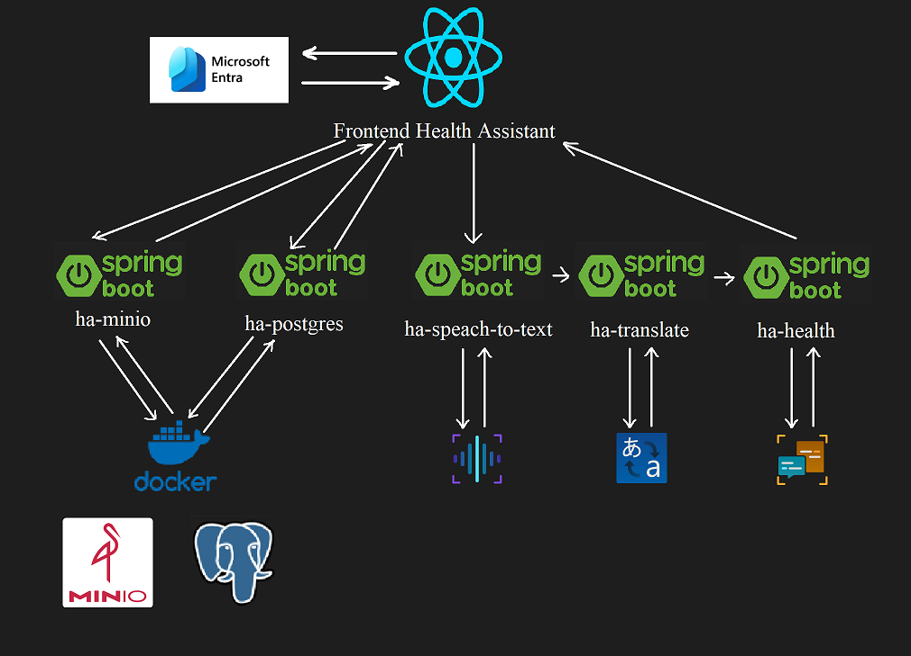
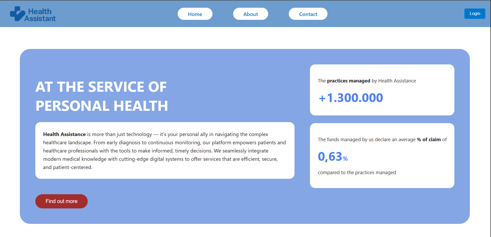
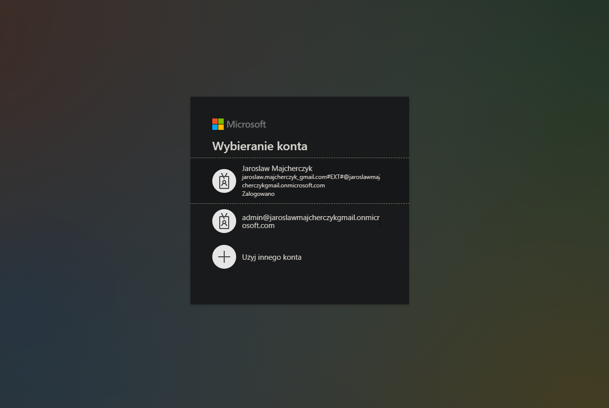
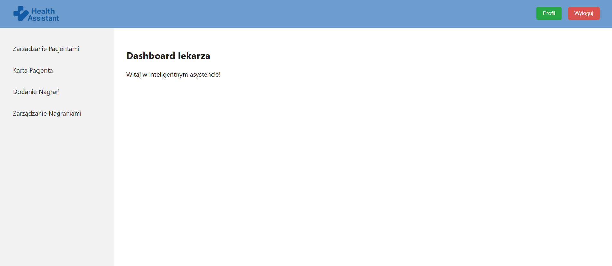
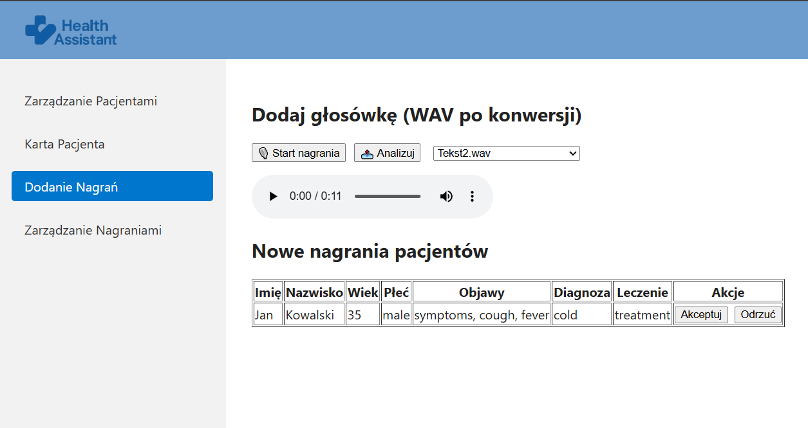
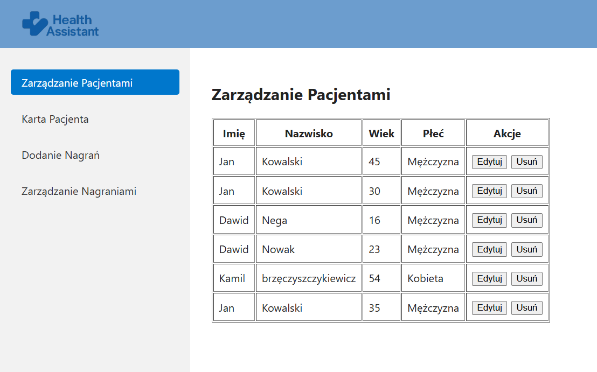
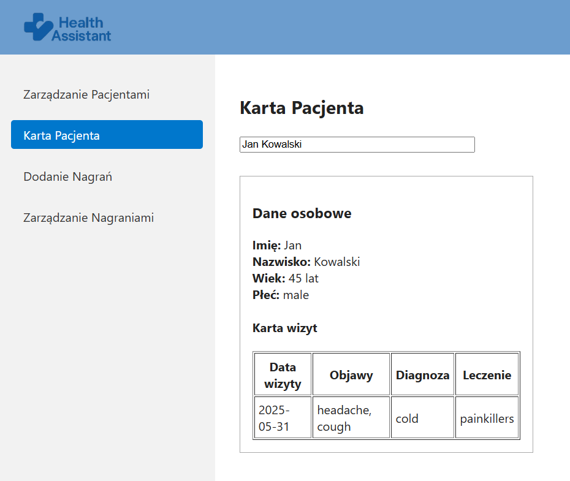
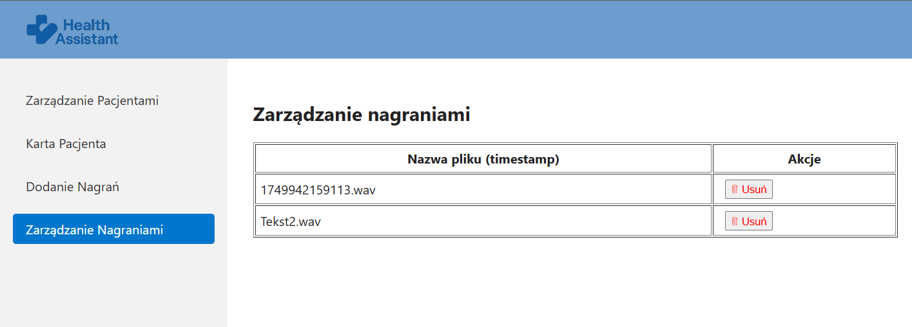

# 🏥 Health Assistant – Inteligentna Platforma dla Lekarzy

**Health Assistant** to aplikacja webowa zbudowana w technologii **React.js**, która wspiera lekarzy w zarządzaniu pacjentami,
analizie danych medycznych i automatyzacji pracy za pomocą sztucznej inteligencji (AI).

---

## 🧠 Funkcjonalności

- 🔐 **Logowanie przez Microsoft Entra ID (Azure AD)**


---

## ⚙️ Technologie

- Frontend: **React.js (Vite) + Sass**
- Autoryzacja: **Microsoft Entra ID**
- Routing: **react-router-dom**

---

## 🚀 Jak uruchomić projekt lokalnie

### 1. 🔧 Wymagania
- Node.js zainstalowany
- Konto w **Microsoft Entra (Azure)**

### 2. 🛠️ Rejestracja aplikacji w Entra

1. Przejdź na: https://entra.microsoft.com/
2. Zarejestruj nową aplikację
3. Skopiuj:
   - `Application (client) ID`
   - `Directory (tenant) ID` lub użyj `organizations`
4. Ustaw:
   - **Redirect URI**: `http://localhost:5173/`

📌 Upewnij się, że dodasz siebie jako użytkownika/testera do aplikacji.

### 3. 🔐 Utwórz plik `.env`

W głównym folderze projektu utwórz plik `.env` i wpisz:

```
VITE_CLIENT_ID=your-client-id-here
VITE_AUTHORITY=https://login.microsoftonline.com/{ you organizations}
VITE_REDIRECT_URI=http://localhost:5173/
```

❗ Plik `.env` jest ignorowany przez Gita i nie trafi do repozytorium.

### 4. 📦 Instalacja zależności

W terminalu:

```bash
npm install
```

### 5. 🧪 Uruchom aplikację

```bash
npm run dev
```

Aplikacja powinna być dostępna pod `http://localhost:5173/`

---

### 6. 🛡️ Zabezpieczenia

- Dostęp do `/dashboard` i jego podstron (np. `patients`, `card`, `recordings`, `profile`) jest chroniony – możliwy **tylko po zalogowaniu przez Entra**
- Użyto komponentu `RequireAuth` do ochrony tras

---

### 7. 📁 Struktura projektu

```
src/
├── assets/                     # Obrazy i logo
├── components/                 # Komponenty wspólne (np. RequireAuth)
├── pages/
│   ├── home/                   # Strona główna
│   ├── about/                  # O aplikacji
│   ├── contact/                # Kontakt
│   ├── layout/                 # Layout nawigacyjny
│   ├── dashboard_layout/       # Layout dla zalogowanych
│   └── dashboard/              # Zawartość dashboardu (patients, card, recordings)
├── App.jsx
└── main.jsx
```

---

### 8. 🧠 Mikroserwisy i ich funkcje
- 🎧 ha-minio – przechowywanie i pobieranie nagrań audio

- 🧾 ha-postgres – obsługa bazy danych PostgreSQL (informacje o pacjentach)

- 🗣️ ha-speach-to-text – przekształcanie nagrania głosowego na tekst

- 🌐 ha-translator – tłumaczenie tekstu na język angielski (Azure Translator)

-  🏥 ha-health – ekstrakcja informacji medycznych z tekstu (Azure Text Analytics)

---

### 9. 🔄 Komunikacja frontend ↔ backend

```
server: {
  proxy: {
    '/api/minio':     'http://localhost:8081',
    '/api/postgres':  'http://localhost:8082',
    '/api/stt':       'http://localhost:8083',
    '/api/translate': 'http://localhost:8084',
    '/api/health':    'http://localhost:8085/health'
  }
}

```
---

### 10. 🔁 Przykładowy przepływ danych

1. Lekarz nagrywa notatkę → plik trafia do ha-minio
2. Nagranie jest analizowane przez ha-speach-to-text i zamieniane na tekst
3. Tekst tłumaczony jest na angielski przez ha-translator
4. Przetłumaczony tekst przesyłany jest do ha-health, który wyodrębnia dane:

   - firstName, lastName, age, gender
   - symptoms, diagnosis, treatment

5. Informacje są zapisywane w ha-postgres jako karta pacjenta

---

### 11. 🧪 Jak uruchomić backend lokalnie
1. 🔧 Wymagania
   Java 17+
   Maven (./mvnw)
   Docker (MinIO, PostgreSQL)

2. 🛠️ Uruchamianie mikroserwisów
   Każdy mikroserwis uruchamiasz osobno:
      cd ha-minio
      ./mvnw spring-boot:run

---

### 12. 🧭 Architektura systemu

Poniżej przedstawiono ogólny przepływ danych i komunikację pomiędzy komponentami systemu:



Na diagramie:

- 🔵 Frontend: aplikacja React (Vite) komunikuje się z backendem poprzez proxy
- 🟢 Backend: 5 mikroserwisów Spring Boot realizuje osobne zadania
- 🔄 Komunikacja między serwisami odbywa się przez REST API
- ☁️ Usługi zewnętrzne: Microsoft Azure (Entra, Translator, Speech-to-Text, Text Analytics)
- 🗂️ MinIO i PostgreSQL działają w kontenerach Docker

---

### 13. 🔐 Autoryzacja – Microsoft Entra ID - Frontend

Autoryzacja w aplikacji Health Assistant jest realizowana przez bibliotekę @azure/msal-react, która integruje się z Microsoft Entra (Azure Active Directory). Dzięki temu dostęp do /dashboard mają tylko zalogowani użytkownicy organizacji.

   ## 🧠 Inicjalizacja w aplikacji
W pliku main.jsx tworzony jest obiekt PublicClientApplication i przekazywany przez MsalProvider:

```
import { MsalProvider } from '@azure/msal-react'
import { msalConfig } from './authConfig'

const msalInstance = new PublicClientApplication(msalConfig)

createRoot(document.getElementById('root')).render(
  <StrictMode>
      <MsalProvider instance={msalInstance}>
        <App />
      </MsalProvider>
  </StrictMode>,
)
```

---

### 14. 🎧 ha-minio – Przechowywanie nagrań audio

Serwis ha-minio odpowiada za upload, pobieranie, listowanie i usuwanie plików audio w formacie .wav. Pliki te są przechowywane w systemie MinIO, a opcjonalnie towarzyszą im pliki .meta.json zawierające dodatkowe metadane (np. wyświetlana nazwa nagrania).

## 🎮 AudioController.java – kontroler zarządzający nagraniami audio

Kontroler AudioController w mikroserwisie ha-minio udostępnia REST API do operacji na plikach .wav przechowywanych w systemie MinIO. Umożliwia dodawanie, pobieranie, listowanie i usuwanie nagrań audio.

1. Upload pliku (/audio/upload)
```
@PostMapping("/upload")
public ResponseEntity<String> upload(@RequestParam("file") MultipartFile file)
```
2. Lista plików (/audio/list)
```
@GetMapping("/list")
public List<String> list()
```
---

### 15. 🧾 ha-postgres – Obsługa danych pacjentów (PostgreSQL)

Mikroserwis ha-postgres odpowiada za zarządzanie danymi pacjentów i historią ich wizyt lekarskich. Używa bazy danych PostgreSQL do trwałego przechowywania rekordów, a cały dostęp realizowany jest poprzez REST API.

## 🎮 PatientController.java – kontroler zarządzający pacjentami

Kontroler udostępnia zestaw endpointów do tworzenia, edytowania, usuwania i pobierania pacjentów oraz przypisanych do nich wizyt.

1. POST /patients/add-visit
- Obsługuje jednocześnie dodanie nowego pacjenta oraz dodanie wizyty do już istniejącego pacjenta
- Na podstawie danych wejściowych tworzony jest obiekt PatientDto oraz PatientVisitDto
- Jeśli pacjent istnieje – dołączana jest nowa wizyta, jeśli nie – tworzony jest nowy pacjent z pierwszą wizytą

---

### 16. 🗣️ ha-speach-to-text – Rozpoznawanie mowy (Speech-to-Text)

Mikroserwis ha-speach-to-text odpowiada za transkrypcję nagrań audio do tekstu. Wykorzystuje usługę Azure Speech-to-Text, aby przekształcić mowę w języku polskim na tekst, a następnie (opcjonalnie) tłumaczy go na angielski poprzez mikroserwis ha-translator.

1. POST /transcribe
- Oczekuje pliku dźwiękowego .wav lub .mp3 jako multipart/form-data
- Przekazuje plik do serwisu AzureSpeechService w celu transkrypcji
- Jeśli rozpoznany tekst jest niepusty, przekazuje go do TranslatorClient (czyli do mikroserwisu ha-translator)
- Zwraca przetłumaczony tekst jako String (w języku angielskim)

---

### 17. 🌐 ha-translator – Tłumaczenie tekstu (Azure Translator)

Mikroserwis ha-translator realizuje tłumaczenie tekstu z języka polskiego na angielski przy użyciu usługi Microsoft Azure Translator. Jest wykorzystywany m.in. przez ha-speach-to-text oraz frontend React w celu przetłumaczenia opisu medycznego przed analizą NLP.

1. POST /translate
- Przyjmuje obiekt JSON z tekstem i docelowym językiem ("en")
- Przykład żądania:
```
{
  "text": "Pacjent skarży się na ból głowy i zawroty.",
  "to": "en"
}
```
- Przekazuje dane do warstwy TranslatorService, która wykonuje zapytanie HTTP do Azure Translator API
- Zwraca przetłumaczony tekst w formacie JSON
- Przykład odpowiedzi:
```
{
  "translatedText": "The patient complains of headache and dizziness."
}
```

---

### 18. 🏥 ha-health – Analiza medyczna tekstu (Entity Recognition)

Mikroserwis ha-health wykorzystuje usługę Azure Text Analytics (Language API) do rozpoznawania encji medycznych i kluczowych fraz w tekstach klinicznych. Jego celem jest automatyczne wyodrębnienie danych pacjenta z przetłumaczonego wcześniej opisu wizyty (np. objawów, diagnozy, leczenia).

1. POST /health/analyze
- Odbiera tekst w języku angielskim jako JSON:
```
{ "text": "The patient has high blood pressure and takes aspirin." }
```
- Przekazuje go do TextAnalyticsService, który łączy się z Azure i pobiera:
   - Rozpoznane encje (np. objawy, leki, parametry zdrowotne)
   - Frazy kluczowe (np. „high blood pressure”)
- Otrzymane dane są parsowane przez HealthParserService do struktury PatientInfo:
```
private String firstName;
private String lastName;
private Integer age;
private String gender;
private List<String> symptoms;
private List<String> diagnosis;
private List<String> treatment;
```
2.  Automatyczne wysyłanie do frontendu
Po utworzeniu PatientInfo, mikroserwis:
- Wysyła go do endpointu http://localhost:5173/api/recordings (frontend)
- Używa RestTemplate i nagłówka Content-Type: application/json
- Zwraca status HTTP (200, 400 itp.)

## 3. Przykład działania (pipeline)
1. Tekst (np. z transkrypcji) trafia do ha-health
2. Azure Text Analytics rozpoznaje encje (objawy, leki, diagnozy itp.)
3. Dane są konwertowane do obiektu PatientInfo
4. Wynik trafia na frontend (gdzie może być wyświetlony/zapisany)
5. Dane tymczasowo dostępne są także pod /health/recordings

---

### 19. 🖼️ Przebieg działania aplikacji – Zrzuty ekranu

Poniżej przedstawiono kluczowe etapy działania aplikacji Health Assistant, od logowania aż po analizę nagrań i zarządzanie pacjentami.


1. Ekran główny (Landing Page)
Aplikacja uruchamia się na stronie głównej z nawigacją do sekcji Home / About / Contact. Użytkownik może kliknąć przycisk Login, aby zalogować się przez Microsoft Entra ID (Azure).


2. Logowanie przez Microsoft Entra ID
Po kliknięciu Login, użytkownik jest przekierowywany do Microsoft Entra, gdzie wybiera konto służbowe. Aplikacja wspiera uwierzytelnianie SSO.


3. Dashboard 
Strona powitalna


4. Dodawanie nagrań – Transkrypcja głosu
Użytkownik może dodać plik .wav lub nagrać wiadomość. Po kliknięciu Analizuj:
- Plik trafia do ha-minio
- Jest transkrybowany przez ha-speach-to-text
- Tłumaczony na angielski (ha-translator)
- Przetwarzany i analizowany przez ha-health (Azure Text Analytics)
Nowe dane pacjenta wyświetlają się w tabeli poniżej – użytkownik może je zaakceptować lub odrzucić


5. Zarządzanie pacientami
Sekcja pozwala przeglądać i edytować listę wszystkich pacjentów, w tym dane osobowe i płeć. Każdego pacjenta można edytować lub usunąć.


6. Karta pacienta
Po wybraniu pacjenta można przejrzeć jego kartę osobową oraz historię wizyt. Dane te są zapisywane i pobierane z mikroserwisu ha-postgres.


7. Zarządzanie nagraniami 
W tej zakładce użytkownik widzi listę wszystkich zapisanych plików głosowych wraz z możliwością ich usunięcia z MinIO.

---

### 20. ✅ Wnioski

Realizacja aplikacji `Health Assistant` pozwoliła zapoznać się z możliwościami usług `Microsoft Azure`, takimi jak Entra ID, Speech-to-Text i Text Analytics. Integracja tych rozwiązań z architekturą mikroserwisową opartą na Spring Boot oraz frontendem w React.js umożliwiła stworzenie funkcjonalnej aplikacji wspierającej lekarzy. Praca nad projektem poszerzyła wiedzę zarówno z zakresu technologii chmurowych, jak i budowy skalowalnych systemów webowych.

---